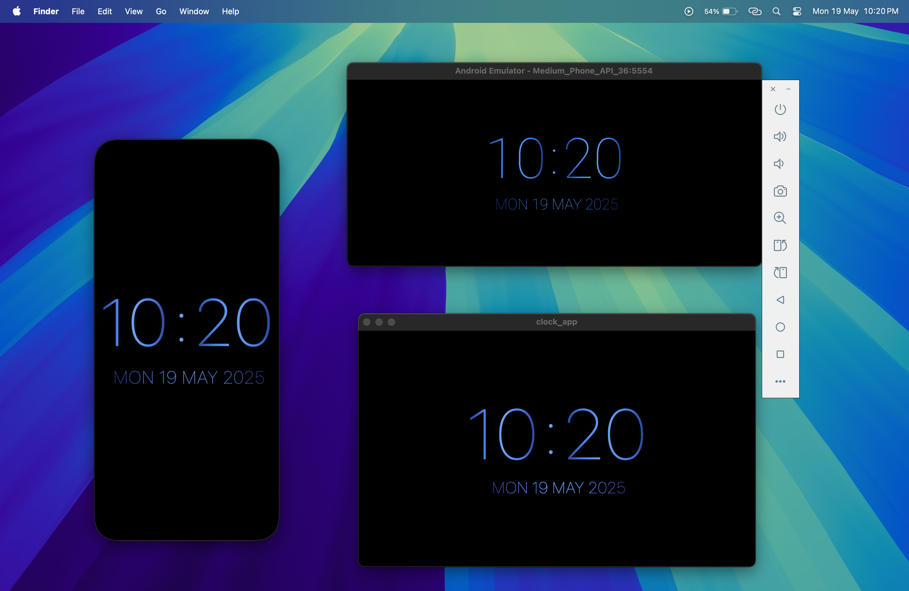

<!DOCTYPE html>
<html lang="en">
<head>
  <meta charset="UTF-8">
  <title>Always-On Minimal Clock - Flutter Project</title>
</head>
<body>

  <h1>🕒 Always-On Minimal Clock – Flutter Project</h1>

  

    Most "Always-On Clock" apps available today either show intrusive ads, offer bloated designs, or lack basic features like minimalism and platform flexibility. 
    After trying out many such apps and being disappointed, I decided to build my own solution — something simple, clean, and reliable.
  

  

    This project is a fully functional <strong>Always-On Minimal Clock</strong> built using <strong>Flutter</strong>. 
    It focuses on simplicity and cross-platform compatibility while avoiding distractions and unnecessary features. 
    While the codebase is still a work in progress and may not follow all industry standards, Yet it <strong>works the way it should</strong>.
  

  

    The project also includes <strong>CI/CD integration using GitHub Actions</strong>, so a new APK is automatically built and uploaded to the 
    <a href="https://github.com/quickcodes/clock_app/releases/">Releases section</a> every time a new release is published.
  

  <h2>✨ Features</h2>
  <ul>
    <li>🧭 Always-on display functionality</li>
    <li>🧼 Minimal, distraction-free UI</li>
    <li>🛠️ Built with Flutter for easy cross-platform compatibility</li>
    <li>🚫 No ads or unnecessary bloat</li>
    <li>💡 Lightweight and battery-friendly</li>
    <li>⚙️ CI/CD setup with GitHub Actions — APK auto-generated on release</li>
  </ul>

  <h2>🧩 Platforms Supported</h2>
  <ul>
    <li>✅ Android</li>
    <li>✅ iOS</li>
    <li>✅ macOS</li>
    <li>✅ Windows</li>
    <li>✅ Linux</li>
    <li>✅ Web</li>
  </ul>

  <h2>🚀 Getting Started</h2>
  <ol>
    <li><strong>Clone the repo:</strong>
      <pre><code>git clone https://github.com/quickcodes/clock_app.git
cd flutter-minimal-clock</code></pre>
    </li>
    <li><strong>Install dependencies:</strong>
      <pre><code>flutter pub get</code></pre>
    </li>
    <li><strong>Run the app:</strong>
      <pre><code>flutter run</code></pre>
    </li>
  </ol>
  
Make sure you have a device or emulator connected.

  <h2>📸 Screenshot</h2>
  

  <h2>🎬 Demo Video</h2>
  <video width="400" controls>
    <source src="preview_ss/video.mp4" type="video/mp4">
    Your browser does not support the video tag.
  </video>

  <h2>🛠 Future Improvements</h2>
  <ul>
    <li>Code cleanup and refactoring for better readability</li>
    <li>Add customizable themes or styles</li>
    <li>Add support for different time formats (12h/24h)</li>
  </ul>

  <h2>🙌 Contribution</h2>
  

    Feel free to fork this repository, open issues, or submit pull requests.
    Any improvements or suggestions are welcome!
  

  <h2>📄 License</h2>
  
This project is open-source and available under the <a href="LICENSE">MIT License</a>.

</body>
</html>
